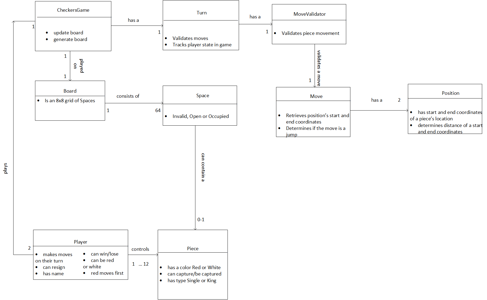
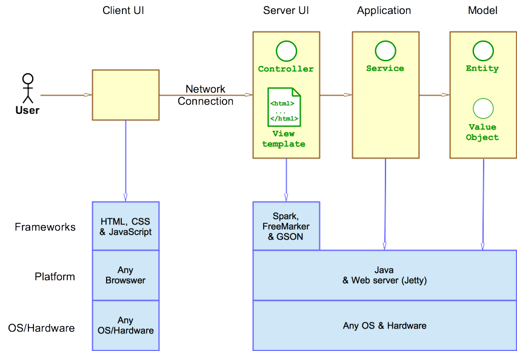
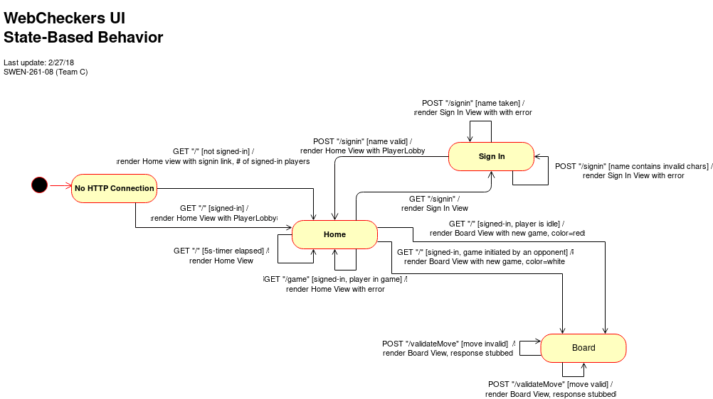

# WebCheckers Design Documentation

> The following template provides the headings for your Design Documentation.  As you edit each section make sure you remove these commentary 'blockquotes'; the lines that start with a > character.

# Team Information
* Team name: (2175) SWEN-261-08-Team-C
* Team members
  * Ian Flournoy <icf6667@rit.edu>
  * Rohandeep Singh <rs9773@rit.edu>
  * Logan D'Auria <lxd1644@rit.edu>
  * Justin M. Palmer <jxp8764@rit.edu>
  * Alexis Halbur <adh9570@rit.edu>

## Executive Summary

The web application for Webcheckers allows players to play checkers with other players who are currently signed in. The game user interface supports a game experience using drag-and-drop browser capabilities for making moves. Beyond these simple capabilities, players are able to play in Tournament Mode against other players in Tournament Mode, as well as being able to request help from the application on what moves to make in order to win the game.

### Purpose
> Users play against one another in a game of checkers, competing to win.

### Glossary and Acronyms
> Provide a table of terms and acronyms.

| Term | Definition |
|------|------------|
| VO | Value Object |

## Requirements

> Players must be able to sign-in to the application and start a game against other players. Using drag-and-drop capabilities, players move pieces down the board, jumping over their opponents, to advance towards winning the game.
> If players reach their opponent's end of the board, their pieces will be "kinged," giving the piece advanced capabilities to move in any direction on the board.
> Players have the option to enter Tournament Mode, in which they compete against other players to place in a 1st, 2nd, etc. style ranking system.

### Definition of MVP
> Each player must sign-in before playing a game, and be able to sign-out when finished playing.
> Two players must be able to play a game of checkers based upon the American rules.
> Either player of a game may choose to resign, at any point, which ends the game.

### MVP Features
> Player Sign-In
> > As a Player, I want to be able to sign-in so that I can play a game of checkers.
> 
> Player Sign-Out
> > As a Player, I want to be able to sign-out so that I can do other things.
>
> Finding a Game
> As a signed-in Player, I want to be able to find a regular game or join the tournament so that I can play checkers.
>
> Start a Game
> > As a Player, I want to start a game so that I can play checkers against an opponent.
>
> Single Move
> > As a Player, I want to be able to move my pieces diagonally away from me so that I can advance towards the far end of the board.
>
> JUMP MOVES
> > As a Player, I want to be forced to make an available jump move so that I will gain an advantage in the game.
> >
> > Single Jump Move
> > > As a Player, I want to be able to jump diagonally forward over an opponent piece so that I can eliminate the piece and advance in the game.
> > 
> > Multi Jump Move
> > > As a Player, I want to be able to diagonally jump over my opponents pieces in one turn so that I can eliminate two or more of their pieces.
> 
> Unable to Move
> > As a Player, I want to lose the game when I have no moves left so that I can move on and start a new game.
> 
> KINGS
> > As a Player, I want to have Kinged pieces so that I will be able to capture more opponent pieces.
> >
> > King Me
> > > As a Player, I want to have my pieces that reach the opponent end of the board to become Kings so that I can move diagonally forwards and backwards.
> >
> > King Moving
> > > As a Player, I want to move my Kings diagonally forwards and backwards so that I can capture more of my opponent's pieces.
>
> Resignation
> > As a Player, I want to be able to resign from an ongoing game so that I can go do other things.

### Roadmap of Enhancements
> Provide a list of top-level features in the order you plan to consider them.

## Application Domain

This section describes the application domain.

> Provide a high-level overview of the domain for this application. You can discuss the more important domain entities and their relationship to each other.

## Architecture

This section describes the application architecture.

### Summary

The following Tiers/Layers model shows a high-level view of the webapp's architecture.

As a web application, the user interacts with the system using a browser.  The client-side
of the UI is composed of HTML pages with some minimal CSS for styling the page.  There is also
some JavaScript that has been provided to the team by the architect.

The server-side tiers include the UI Tier that is composed of UI Controllers and Views.
Controllers are built using the Spark framework and View are built using the FreeMarker framework.  The Application and Model tiers are built using plain-old Java objects (POJOs).

Details of the components within these tiers are supplied below

### Overview of User Interface

This section describes the web interface flow; this is how the user views and interacts
with the WebCheckers application.

> Provide a summary of the application's user interface.  Describe, from the user's perspective, the flow of the pages in the web application.

### UI Tier
> Provide a summary of the Server-side UI tier of your architecture.
> Describe the types of components in the tier and describe their responsibilities.

#### Static models
> Provide one or more static models (UML class or object diagrams) with some details such as critical attributes and methods.

#### Dynamic models
> Provide any dynamic models, such as state and sequence diagrams, as is relevant to a particularly significant user story.
> For example, in WebCheckers you might create a sequence diagram of the `POST /validateMove` HTTP request processing or you might use a state diagram if the Game component uses a state machine to manage the game.

### Application Tier
> Provide a summary of the Application tier of your architecture.
> Describe the types of components in the tier and describe their responsibilities.

#### Static models
> Provide one or more static models (UML class or object diagrams) with some details such as critical attributes and methods.

#### Dynamic models
> Provide any dynamic model, such as state and sequence diagrams, as is relevant to a particularly significant user story.

### Model Tier
> Provide a summary of the Model tier of your architecture.
> Describe the types of components in the tier and describe their responsibilities.

#### Static models
> Provide one or more static models (UML class or object diagrams) with some details such as critical attributes and methods.

#### Dynamic models
> Provide any dynamic model, such as state and sequence diagrams, as is relevant to a particularly significant user story.
