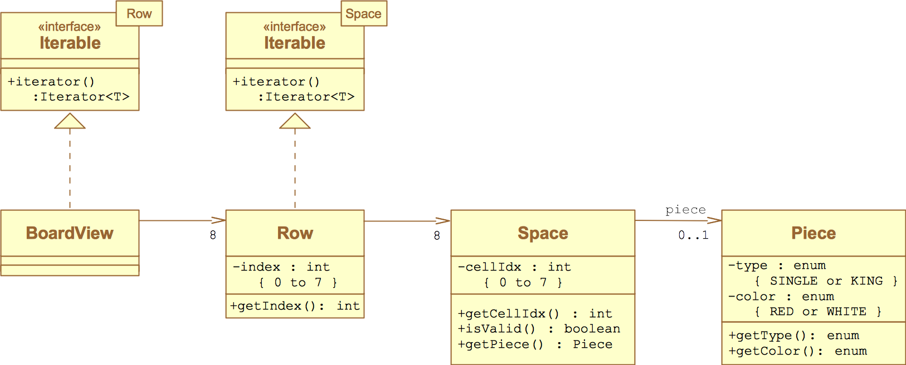

# WebCheckers Design Documentation

### Team Information

**Name**: `(2175) SWEN-261-08-Team-C`

**Members:**

  * Ian Flournoy <icf6667@rit.edu>
  * Rohandeep Singh <rs9773@rit.edu>
  * Logan D'Auria <lxd1644@rit.edu>
  * Justin M. Palmer <jxp8764@rit.edu>
  * Alexis Halbur <adh9570@rit.edu>

## Executive Summary

The web application for Webcheckers allows players to play checkers with other players who are currently signed in. The game user interface supports a game experience using drag-and-drop browser capabilities for making moves. Beyond these simple capabilities, players are able to play in Tournament Mode against other players in Tournament Mode, as well as being able to request help from the application on what moves to make in order to win the game.

### Purpose
*Users play against one another in a game of checkers, competing to win.*

### Glossary and Acronyms
| Term | Definition |
|------|------------|
| VO | Value Object |

\pagebreak

# Requirements
> Players must be able to sign-in to the application and start a game against other players. Using drag-and-drop capabilities, players move pieces down the board, jumping over their opponents, to advance towards winning the game.
> If players reach their opponent's end of the board, their pieces will be "kinged," giving the piece advanced capabilities to move in any direction on the board.
> Players have the option to enter Tournament Mode, in which they compete against other players to place in a 1st, 2nd, etc. style ranking system.

## Definition of MVP
> Each player must sign-in before playing a game, and be able to sign-out when finished playing.
> Two players must be able to play a game of checkers based upon the American rules.
> Either player of a game may choose to resign, at any point, which ends the game.

## MVP Features

[TODO]: # Rewrite these features as table, and a short summary of the feature. No need to duplicate full story text here.

> <b>Player Sign-In</b>
> > As a Player, I want to be able to sign-in so that I can play a game of checkers.
>
> <b>Player Sign-Out</b>
> > As a Player who is signed into WebCheckers I want to be able to sign-out so that I am not placed in any new games.
>
> <b>Start a Game</b>
> > As a Player, I want to start a game so that I can play checkers against an opponent.
>
> <b>Single Move</b>
> > As a Player, I want to be able to move my pieces diagonally away from me so that I can advance towards the far end of the board.
>
> <b>JUMP MOVES</b>
> > As a Player, I want to be forced to make an available jump move so that I will gain an advantage in the game.
> >
> > <b>Single Jump Move</b>
> > > As a Player, I want to be able to jump diagonally forward with a single piece or in either direction with a King over an opponent piece so that I can eliminate the piece and advance in the game.
> >
> > <b>Multi Jump Move</b>
> > > As a Player, I want to be able to diagonally jump over my opponents pieces in one turn so that I can eliminate two or more of their pieces.
>
> <b>Unable to Move</b>
> > As a Player, I want to lose the game when I have no moves left so that I can move on and start a new game.
>
> <b>Winning</b>
> > As a Player, I want to win the game by capturing all of my opponent pieces so that I can claim victory.
>
> <b>King Me</b>
> > As a Player, I want to have my pieces that reach the opponent end of the board to become Kings so that I can move diagonally forwards and backwards.
>
> <b>Resignation</b>
> > As a Player in an ongoing game I want to be able to forfeit from an ongoing game so that I can return to the lobby.

## Roadmap of Enhancements
> <b>Getting Help</b>
> > As a Player, I want to have valid next-moves shown to me when I request help so that I can advance in the game.
>
> <b>TOURNAMENT MODE</b>
> > As a competitive Player, I want to play games inside a Tournament Ladder so that I can see my ranking against other Tournament players.
> >
> > <b>Finding a Game</b>
> > > As a Player, I want to be able to find a regular game or joing the Tournament so that I can play checkers.
> >
> > <b>Tournament Scoreboard</b>
> > > As a competitive Player, I want to be able to view the Tournament Ladder when curious so that I can follow the Tournament.

\pagebreak

# Application Domain

Below are the entities involved in the Checkers application domain. In every checkers game there always exists two players who controls pieces that are placed on squares of a board.  There is a logical concept of a "game" between these two players that is modeled in the diagram for cohesion.

[TODO]: # Write more about the application domain to provide good context

\pagebreak

# Architecture

This section details the design choices and relationships between the components in the software architecture.

## Summary

The following diagram shows the composition of the web application by logical tier.

The **Client UI** is comprised of a JavaScript framework handling user interactions in their web browser. Basic CSS styling controls how the Client UI is presented in the user's browser. The Client UI interacts with the **Server UI** over HTTP using direct and AJAX calls.

The **Server UI** contains controllers for each HTTP route. These controllers exchange data with the Client UI and work with the **Application** tier. Also included in the Server UI tier are the FreeMarker templates and ViewModels that produce HTML to be rendered in the client's browser.

The **Application** tier contains service components that exchange data between the Server UI components and Models comprising the application domain.

The **Model** tier is made of Value Objects and Entities of the application domain.

Details of the components within these tiers are supplied below

## Overview of User Interface

This section describes the web interface flow; this is how the user views and interacts with the WebCheckers application.

[TODO]: # Include a narrative of the state charts below

\ 

\ 

\pagebreak

## UI Tier

#### WebServer
The WebServer component is responsible for mapping HTTP Verbs and Routes to the Controller responsible for handling the interaction. 

An example of this looks like this:

> `POST /signin` is handled by the controller `PostSignInRoute`

Within the UI tier the controllers can be separated into two categories:

1. Controllers that return a rendered ViewModel, or redirect to another controller
2. Controllers that handle AJAX requests and return a JSON POJO to the Client UI's JavaScript handler. These controllers are mostly used during game-play to handle move and turn logic.
   
#### 1. Controllers returning a rendered ViewModel template
|Controller Name|FreeMarker Template|Function|
|---------------|-------------------|------------------------------------------|
|`GetGameRoute`   |`game.ftl`       | Setup and display a Checkers Game|
|`GetHomeRoute`   |`home.ftl`       | Display the landing page and Player Lobby|
|`GetSignInRoute` |`signin.ftl`     | Display sign-in form|
|`PostSignInRoute`| **redirect**    | Redirect when successful login|
|`GetSignOutRoute`|**redirect**     | Handle signout action|

#### 2. AJAX contollers
|Controller Name       |Request Data     |Response Data|
|----------------------|-----------------|-------------|
|`PostBackupMoveRoute` | **none**        | `Message`|
|`PostCheckTurnRoute`  | **none**        | `Message`|
|`PostResignGameRoute` | **none**        | `Message`|
|`PostSubmitTurnRoute` | **none**        | `Message`|
|`PostValidateMoveRoute` | `Move`        | `Message`|

\pagebreak

### Static models

#### Ideas for models
* Relationship between `WebServer` and controllers
* Relationship between `WebServer` and parent `Application` component (how things are created in Application injected into WebServer)

\pagebreak

### Dynamic models

#### Ideas for dynamic models in the UI tier from Professor's comments
* GetHomeRoute - Interaction with PlayerLobby
* GetSignOutRoute - Interaction with PlayerLobby and GameManager
* PostCheckTurnRoute - interaction with GameManager/CheckersGame/Turn
* PostSignInRoute - How does it determine a name is already taken?
* PostSubmitTurnRoute - Interaction with Player's turn to execute move
* PostValidateMoveRoute - Interaction with Board View, move validation

#### Player Resignation

In the figure below we see the sequence of actions taken when a player wishes to resign from a game.

\ 

#### Player Sign-In

\ 

\pagebreak

## Application Tier

The application tier is made up of [GRASP controller](https://en.wikipedia.org/wiki/GRASP_(object-oriented_design)#Controller) components that handle server-wide interactions players have with the application.

The two main controllers are `GameManager` and `PlayerLobby`. This tier also contains `BoardViewGen` and `RowGen` components that will be detailed later on.

#### GameManager
GameManager's primary focus is to centralized the logic of setting up a Checkers Game, finding an active game, resigning a game. In short this controller is responsible for managing player interactions with a Checkers Game.

#### PlayerLobby
PlayerLobby manages player interactions with the home page. It provides functionality to validate a new player's name, as well as lookup players after they are signed in.

#### BoardViewGen and RowGen
These generators present to the Client UI a view of a checkers board in the way it expects. Internally we represent the checkers board in a more efficient manner, but the Client UI expects the board according to the GameView Board Model (shown below in static models).
    
### Static models

#### Ideas for static models in application tier
* BoardViewGen and RowGen relationship
* GameManager -> CheckersGame, Turn relationship
* PlayerLobby -> Player relationship

#### GameView Board Model
\ 

### Dynamic models

#### Ideas for dynamic models in the application tier
* Building the BoardView
* Setting up a new game between two players
* Getting an existing game
* Resigning a game (kinda covered in UI seq diagram for resign)
* Getting the turn state

\pagebreak

## Model Tier

In true Object Oriented spirit we have tried to make our domain model rich and alive with behavior that intuitively acts on the data our model objects represent. When we found ourselves placing functionality in a fabricated component we would first ask ourselves if the functionality was using data already located in model component. In this way we tried to avoid the [Anemic Domain Model](https://martinfowler.com/bliki/AnemicDomainModel.html) anti-pattern described by Martin Fowler where he states that it is a poor use of Model objects if the data and the logic surrounding that data are not unified.

### Static models

#### Ideas for static models in Model tier
* Relationship of CheckersGame->Turn
* Who uses MoveValidator static class
* Who uses CheckersBoardBuilder
* Relationship of Piece, Position, Move

### Dynamic models

*NOTE: We do have some models already made for dynamic interaction. I chose not to include them now since they need updating*

#### Ideas for dynamic models in the Model tier
* When a new player turn takes effect
* When a move is validated
* When a turn is submitted

\pagebreak

# Logging

|Log level|Function Visibility|Usage|
|------|--------------|-----------------------------------------------------------------------------------------|
|INFO|Public/Private|User actions|
|FINE|Public|Should log at the start, and optionally end, of public methods with the outcome|
|FINER|Private|Object-level detail once per public method (public or private)|
|FINEST|Public/Private|When, why, and outcome of logic decisions. Or when multi-line verbose output is required.|