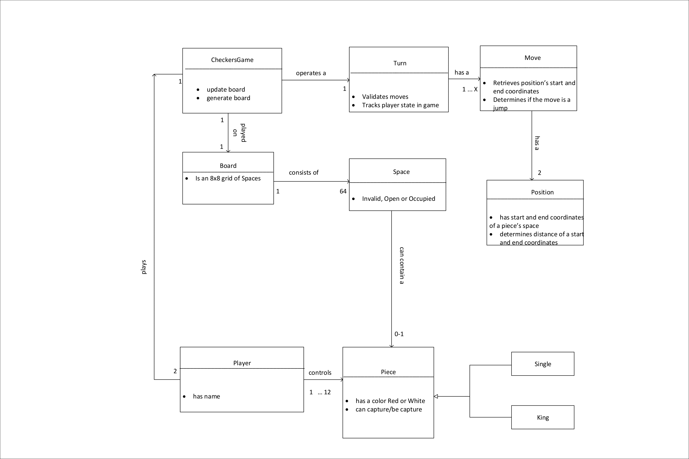

# WebCheckers Design Documentation

### Team Information
* Team name: (2175) SWEN-261-08-Team-C
* Team members
  * Ian Flournoy <icf6667@rit.edu>
  * Rohandeep Singh <rs9773@rit.edu>
  * Logan D'Auria <lxd1644@rit.edu>
  * Justin M. Palmer <jxp8764@rit.edu>
  * Alexis Halbur <adh9570@rit.edu>

## Executive Summary

The web application for Webcheckers allows players to play checkers with other players who are currently signed in. The game user interface supports a game experience using drag-and-drop browser capabilities for making moves. Beyond these simple capabilities, players are able to play in Tournament Mode against other players in Tournament Mode, as well as being able to request help from the application on what moves to make in order to win the game.

### Purpose
> Users play against one another in a game of checkers, competing to win.

### Glossary and Acronyms
| Term | Definition |
|------|------------|
| VO | Value Object |

\pagebreak

# Requirements
> Players must be able to sign-in to the application and start a game against other players. Using drag-and-drop capabilities, players move pieces down the board, jumping over their opponents, to advance towards winning the game.
> If players reach their opponent's end of the board, their pieces will be "kinged," giving the piece advanced capabilities to move in any direction on the board.
> Players have the option to enter Tournament Mode, in which they compete against other players to place in a 1st, 2nd, etc. style ranking system.

## Definition of MVP
> Each player must sign-in before playing a game, and be able to sign-out when finished playing.
> Two players must be able to play a game of checkers based upon the American rules.
> Either player of a game may choose to resign, at any point, which ends the game.

## MVP Features

[TODO]: # Rewrite these features as table, and a short summary of the feature. No need to duplicate full story text here.

> <b>Player Sign-In</b>
> > As a Player, I want to be able to sign-in so that I can play a game of checkers.
>
> <b>Player Sign-Out</b>
> > As a Player who is signed into WebCheckers I want to be able to sign-out so that I am not placed in any new games.
>
> <b>Start a Game</b>
> > As a Player, I want to start a game so that I can play checkers against an opponent.
>
> <b>Single Move</b>
> > As a Player, I want to be able to move my pieces diagonally away from me so that I can advance towards the far end of the board.
>
> <b>JUMP MOVES</b>
> > As a Player, I want to be forced to make an available jump move so that I will gain an advantage in the game.
> >
> > <b>Single Jump Move</b>
> > > As a Player, I want to be able to jump diagonally forward with a single piece or in either direction with a King over an opponent piece so that I can eliminate the piece and advance in the game.
> >
> > <b>Multi Jump Move</b>
> > > As a Player, I want to be able to diagonally jump over my opponents pieces in one turn so that I can eliminate two or more of their pieces.
>
> <b>Unable to Move</b>
> > As a Player, I want to lose the game when I have no moves left so that I can move on and start a new game.
>
> <b>Winning</b>
> > As a Player, I want to win the game by capturing all of my opponent pieces so that I can claim victory.
>
> <b>King Me</b>
> > As a Player, I want to have my pieces that reach the opponent end of the board to become Kings so that I can move diagonally forwards and backwards.
>
> <b>Resignation</b>
> > As a Player in an ongoing game I want to be able to forfeit from an ongoing game so that I can return to the lobby.

## Roadmap of Enhancements
> <b>Getting Help</b>
> > As a Player, I want to have valid next-moves shown to me when I request help so that I can advance in the game.
>
> <b>TOURNAMENT MODE</b>
> > As a competitive Player, I want to play games inside a Tournament Ladder so that I can see my ranking against other Tournament players.
> >
> > <b>Finding a Game</b>
> > > As a Player, I want to be able to find a regular game or joing the Tournament so that I can play checkers.
> >
> > <b>Tournament Scoreboard</b>
> > > As a competitive Player, I want to be able to view the Tournament Ladder when curious so that I can follow the Tournament.

\pagebreak

# Application Domain

Below are the entities involved in the Checkers application domain. In every checkers game there always exists two players who controls pieces that are placed on squares of a board.  There is a logical concept of a "game" between these two players that is modeled in the diagram for cohesion.

[TODO]: # Write more about the application domain to provide good context

\pagebreak

# Architecture

This section details the design choices and relationships between the components in the software architecture.

## Summary

The following diagram shows the composition of the web application by logical tier.

The **Client UI** is comprised of a JavaScript framework handling user interactions in their web browser. Basic CSS styling controls how the Client UI is presented in the user's browser. The Client UI interacts with the **Server UI** over HTTP using direct and AJAX calls.

The **Server UI** contains controllers for each HTTP route. These controllers exchange data with the Client UI and work with the **Application** tier. Also included in the Server UI tier are the FreeMarker templates and ViewModels that produce HTML to be rendered in the client's browser.

The **Application** tier contains service components that exchange data between the Server UI components and Models comprising the application domain.

The **Model** tier is made of Value Objects and Entities of the application domain.

Details of the components within these tiers are supplied below

## Overview of User Interface

This section describes the web interface flow; this is how the user views and interacts with the WebCheckers application.

[TODO]: # Include a narrative of the state charts below

\ 

\ 

\pagebreak

## UI Tier

#### WebServer
The WebServer component is responsible for mapping HTTP Verbs and Routes to the Controller responsible for handling the interaction. 

An example of this looks like this:

> `POST /signin` is handled by the controller `PostSignInRoute`

Within the UI tier the controllers can be separated into two categories:

1. Controllers that return a rendered ViewModel, or redirect to another controller
2. Controllers that handle AJAX requests and return a JSON POJO to the Client UI's JavaScript handler. These controllers are mostly used during game-play to handle move and turn logic.
   
#### 1. Controllers returning a rendered ViewModel template
|Controller Name|FreeMarker Template|Function|
|---------------|-------------------|------------------------------------------|
|`GetGameRoute`   |`game.ftl`       | Setup and display a Checkers Game|
|`GetHomeRoute`   |`home.ftl`       | Display the landing page and Player Lobby|
|`GetSignInRoute` |`signin.ftl`     | Display sign-in form|
|`PostSignInRoute`| **redirect**    | Redirect when successful login|
|`GetSignOutRoute`|**redirect**     | Handle signout action|

#### 2. AJAX contollers
|Controller Name       |Request Data     |Response Data|
|----------------------|-----------------|-------------|
|`PostBackupMoveRoute` | **none**        | `Message`|
|`PostCheckTurnRoute`  | **none**        | `Message`|
|`PostResignGameRoute` | **none**        | `Message`|
|`PostSubmitTurnRoute` | **none**        | `Message`|
|`PostValidateMoveRoute` | `Move`        | `Message`|

\pagebreak

### Static models

**BoardViewGen**

**RowGen**

### Dynamic models

## Model Tier

> BoardBuilder: Generates a Checkers Board with Board-Row-Space-Piece setup

> CheckersGame: Creates a CheckersGame between two Players

> Message: Passes a text message of either type info or error

> Move: Two positions, a start and an end, that a Piece is being moved to and from

> MoveValidator: Validates that a move being made is a valid one by checking that the piece is moving in the proper direction, and to an unoccupied valid space.

> Piece: Represents a checkers piece

> Player: Plays the game

> Position: A set of coordinates on the board; a location

> Space: Within a row, can contain a piece and is in state invalid, open, or occupied

> Turn: Runs a Player's turn, either in state empty turn, stable turn, or turn submitted

### Static models

**Move**

**MoveValidator**

**Piece**

**Space**

**Turn**

### Dynamic models

**BoardBuilder**

**Turn: Backup Move**

**Turn: Make Move**

**Turn: Validate Move**

**Turn: Submit**

\pagebreak

# Logging

|Log level|Function Visibility|Usage|
|------|--------------|-----------------------------------------------------------------------------------------|
|INFO|Public/Private|User actions|
|FINE|Public|Should log at the start, and optionally end, of public methods with the outcome|
|FINER|Private|Object-level detail once per public method (public or private)|
|FINEST|Public/Private|When, why, and outcome of logic decisions. Or when multi-line verbose output is required.|