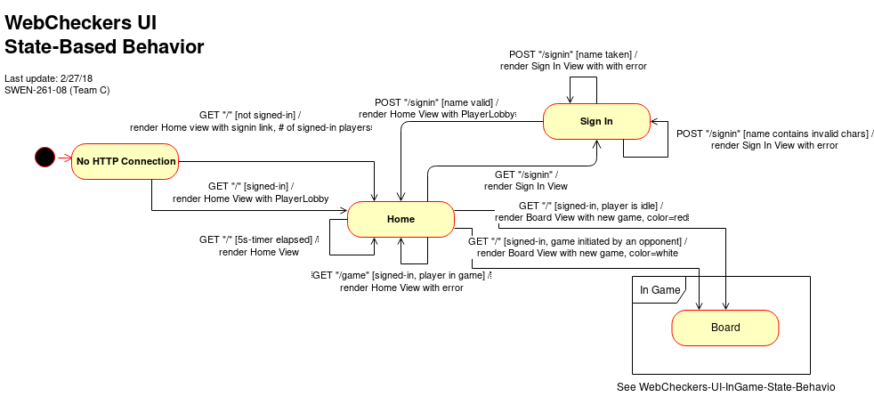

# WebCheckers Design Documentation

### Team Information
* Team name: (2175) SWEN-261-08-Team-C
* Team members
  * Ian Flournoy <icf6667@rit.edu>
  * Rohandeep Singh <rs9773@rit.edu>
  * Logan D'Auria <lxd1644@rit.edu>
  * Justin M. Palmer <jxp8764@rit.edu>
  * Alexis Halbur <adh9570@rit.edu>

## Executive Summary

The web application for Webcheckers allows players to play checkers with other players who are currently signed in. The game user interface supports a game experience using drag-and-drop browser capabilities for making moves. Beyond these simple capabilities, players are able to play in Tournament Mode against other players in Tournament Mode, as well as being able to request help from the application on what moves to make in order to win the game.

### Purpose
> Users play against one another in a game of checkers, competing to win.

### Glossary and Acronyms
| Term | Definition |
|------|------------|
| VO | Value Object |

\pagebreak

# Requirements
> Players must be able to sign-in to the application and start a game against other players. Using drag-and-drop capabilities, players move pieces down the board, jumping over their opponents, to advance towards winning the game.
> If players reach their opponent's end of the board, their pieces will be "kinged," giving the piece advanced capabilities to move in any direction on the board.
> Players have the option to enter Tournament Mode, in which they compete against other players to place in a 1st, 2nd, etc. style ranking system.

## Definition of MVP
> Each player must sign-in before playing a game, and be able to sign-out when finished playing.
> Two players must be able to play a game of checkers based upon the American rules.
> Either player of a game may choose to resign, at any point, which ends the game.

## MVP Features

[TODO]: # Rewrite these features as table, and a short summary of the feature. No need to duplicate full story text here.

> <b>Player Sign-In</b>
> > As a Player, I want to be able to sign-in so that I can play a game of checkers.
>
> <b>Player Sign-Out</b>
> > As a Player who is signed into WebCheckers I want to be able to sign-out so that I am not placed in any new games.
>
> <b>Start a Game</b>
> > As a Player, I want to start a game so that I can play checkers against an opponent.
>
> <b>Single Move</b>
> > As a Player, I want to be able to move my pieces diagonally away from me so that I can advance towards the far end of the board.
>
> <b>JUMP MOVES</b>
> > As a Player, I want to be forced to make an available jump move so that I will gain an advantage in the game.
> >
> > <b>Single Jump Move</b>
> > > As a Player, I want to be able to jump diagonally forward with a single piece or in either direction with a King over an opponent piece so that I can eliminate the piece and advance in the game.
> >
> > <b>Multi Jump Move</b>
> > > As a Player, I want to be able to diagonally jump over my opponents pieces in one turn so that I can eliminate two or more of their pieces.
>
> <b>Unable to Move</b>
> > As a Player, I want to lose the game when I have no moves left so that I can move on and start a new game.
>
> <b>Winning</b>
> > As a Player, I want to win the game by capturing all of my opponent pieces so that I can claim victory.
>
> <b>King Me</b>
> > As a Player, I want to have my pieces that reach the opponent end of the board to become Kings so that I can move diagonally forwards and backwards.
>
> <b>Resignation</b>
> > As a Player in an ongoing game I want to be able to forfeit from an ongoing game so that I can return to the lobby.

## Roadmap of Enhancements
> <b>Getting Help</b>
> > As a Player, I want to have valid next-moves shown to me when I request help so that I can advance in the game.
>
> <b>TOURNAMENT MODE</b>
> > As a competitive Player, I want to play games inside a Tournament Ladder so that I can see my ranking against other Tournament players.
> >
> > <b>Finding a Game</b>
> > > As a Player, I want to be able to find a regular game or joing the Tournament so that I can play checkers.
> >
> > <b>Tournament Scoreboard</b>
> > > As a competitive Player, I want to be able to view the Tournament Ladder when curious so that I can follow the Tournament.

\pagebreak

# Application Domain

Below are the entities involved in the Checkers application domain. In every checkers game there always exists two players who controls pieces that are placed on squares of a board.  There is a logical concept of a "game" between these two players that is modeled in the diagram for cohesion.

[TODO]: # Write more about the application domain to provide good context

\pagebreak

# Architecture

This section details the design choices and relationships between the components in the software architecture.

## Summary

The following diagram shows the composition of the web application by logical tier.

The **Client UI** is comprised of a JavaScript framework handling user interactions in their web browser. Basic CSS styling controls how the Client UI is presented in the user's browser. The Client UI interacts with the **Server UI** over HTTP using direct and AJAX calls.

The **Server UI** contains controllers for each HTTP route. These controllers exchange data with the Client UI and work with the **Application** tier. Also included in the Server UI tier are the FreeMarker templates and ViewModels that produce HTML to be rendered in the client's browser.

The **Application** tier contains service components that exchange data between the Server UI components and Models comprising the application domain.

The **Model** tier is made of Value Objects and Entities of the application domain.

Details of the components within these tiers are supplied below

## Overview of User Interface

This section describes the web interface flow; this is how the user views and interacts
with the WebCheckers application.

## UI Tier
**Webserver**: This links all the route togethers, so that the Player can travel to different pages.

**GetClearRoute**: Players with the name "admin", not case sensistive, can clear the active games in session.
	This route is used for primarly testing.

**GetGameRoute**: This route either creates or retrieves a game for the player and their opponent,
	or it redirects the player to home if they try to start a game with an invalid player or their opponent leaves the game.

**GetHomeRoute**: The home route shows the players not signed in a page with a sign-in button that redirects to a sign in page.
	If the player is signed in and not in a game, they are shown a list of players available in the playerLobby, if they 
	are in a game, then they are redirected to the page to play a game.

**GetSignInRoute**: In this route the player is on a page with a button that allows them to sign-in.

**GetSignOutRoute**: When a Player selects the sign-out button either in the Player Lobby or in a game, GetSignOutRoute will remove the Player from both the Lobby and the session, removes the game from the list of active games in Game Manager, and redirects the signed out Player back to the home page.

**PostBackupMoveRoute**: When a player has made a move, but not confirmed their turn, they can backup a previous move. This UI controller handles the interaction with the frontend AJAX request.

**PostCheckTurnRoute**: On an interval the frontend for both players checks to see if it is their turn. This UI controller gets the game Turn status and returns true/false to the frontend.

**PostResignGameRoute**: When a Player selects the resign button, if the player is in WAITING_FOR_TURN state or EMPTY_TURN state, they are resigned from a game, if not, then they
	are given a "Resign failed" message.

**PostSignInRoute**: This route opens up to a page with a Textfield, that the user uses to enter their username. They get an error
	message when the name already exists in the PlayerLobby or their are invalid characters. When the name is valid, the
	player gets sent back to the homepage.
	
**PostSubmitTurnRoute**: When a player has plotted their moves they can submit their turn. This UI controller interacts with the player's Turn to execute their move.

**PostValidateMoveRoute**: When a player drags and drops a piece on their board view the validateMove UI controller is called in order to check whether the move is to a valid position.

### Static models
> Provide one or more static models (UML class or object diagrams) with some details such as critical attributes and methods.

### Dynamic models

**PostResignGameRoute**

**PostSignInRoute**

## Application Tier
> Provide a summary of the Application tier of your architecture.
> Describe the types of components in the tier and describe their responsibilities.

### Static models

**BoardViewGen**

**RowGen**

### Dynamic models

## Model Tier

> BoardBuilder: Generates a Checkers Board with Board-Row-Space-Piece setup

> CheckersGame: Creates a CheckersGame between two Players

> Message: Passes a text message of either type info or error

> Move: Two positions, a start and an end, that a Piece is being moved to and from

> MoveValidator: Validates that a move being made is a valid one by checking that the piece is moving in the proper direction, and to an unoccupied valid space.

> Piece: Represents a checkers piece

> Player: Plays the game

> Position: A set of coordinates on the board; a location

> Space: Within a row, can contain a piece and is in state invalid, open, or occupied

> Turn: Runs a Player's turn, either in state empty turn, stable turn, or turn submitted

### Static models

**Move**

**MoveValidator**

**Piece**

**Space**

**Turn**

### Dynamic models

**BoardBuilder**

**Turn: Backup Move**

**Turn: Make Move**

**Turn: Validate Move**

**Turn: Submit**

\pagebreak

# Logging

|Log level|Function Visibility|Usage|
|------|--------------|-----------------------------------------------------------------------------------------|
|INFO|Public/Private|User actions|
|FINE|Public|Should log at the start, and optionally end, of public methods with the outcome|
|FINER|Private|Object-level detail once per public method (public or private)|
|FINEST|Public/Private|When, why, and outcome of logic decisions. Or when multi-line verbose output is required.|